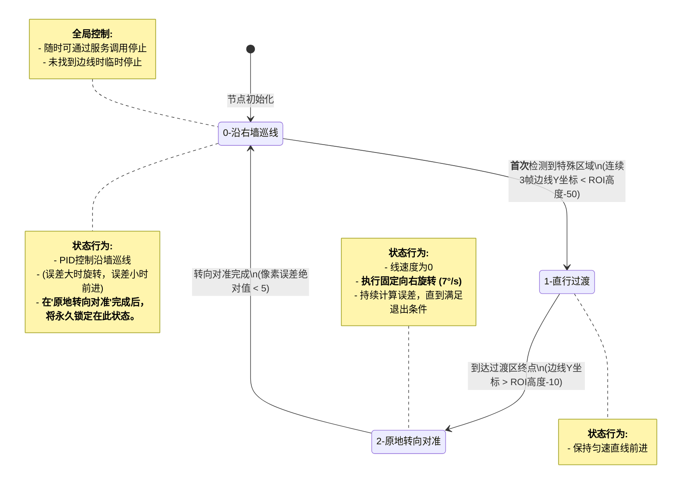

```mermaid
stateDiagram-v2
    %% 状态定义
    FOLLOW_RIGHT: 0-沿右墙巡线
    STRAIGHT_TRANSITION: 1-直行过渡
    ROTATE_ALIGNMENT: 2-原地转向对准
    
    %% 定义初始状态
    [*] --> FOLLOW_RIGHT: 节点初始化

    %% 状态转换
    FOLLOW_RIGHT --> STRAIGHT_TRANSITION: <b>首次</b>检测到特殊区域\n(连续3帧边线Y坐标 < ROI高度-50)
    STRAIGHT_TRANSITION --> ROTATE_ALIGNMENT: 到达过渡区终点\n(边线Y坐标 > ROI高度-10)
    ROTATE_ALIGNMENT --> FOLLOW_RIGHT: 转向对准完成\n(像素误差绝对值 < 5)
    
    %% 沿墙巡线状态说明
    note right of FOLLOW_RIGHT
        <b>状态行为:</b>
        - PID控制沿墙巡线
        - (误差大时旋转，误差小时前进)
        - <b>在'原地转向对准'完成后，<br/>将永久锁定在此状态。</b>
    end note
    
    %% 直行过渡状态说明
    note right of STRAIGHT_TRANSITION
        <b>状态行为:</b>
        - 保持匀速直线前进
    end note

    %% 原地转向对准状态说明 (已更新)
    note left of ROTATE_ALIGNMENT
        <b>状态行为:</b>
        - 线速度为0
        - <b>执行固定向右旋转 (7°/s)</b>
        - 持续计算误差，直到满足退出条件
    end note

    %% 全局控制说明
    note left of FOLLOW_RIGHT
        <b>全局控制:</b>
        - 随时可通过服务调用停止
        - 未找到边线时临时停止
    end note
```