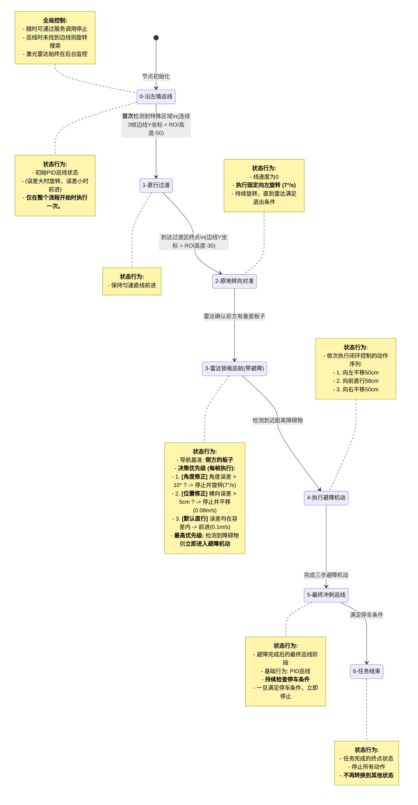

```mermaid
stateDiagram-v2
    %% 状态定义
    FOLLOW_LEFT: 0-沿左墙巡线
    STRAIGHT_TRANSITION: 1-直行过渡
    ROTATE_ALIGNMENT: 2-原地转向对准
    LIDAR_CRUISE: 3-雷达锁板巡航(带避障)
    AVOIDANCE_MANEUVER: 4-执行避障机动
    FOLLOW_TO_FINISH: 5-最终冲刺巡线
    FINAL_STOP: 6-任务结束
    
    %% 定义初始状态
    [*] --> FOLLOW_LEFT: 节点初始化

    %% 状态转换
    FOLLOW_LEFT --> STRAIGHT_TRANSITION: <b>首次</b>检测到特殊区域\n(连续3帧边线Y坐标 < ROI高度-50)
    STRAIGHT_TRANSITION --> ROTATE_ALIGNMENT: 到达过渡区终点\n(边线Y坐标 > ROI高度-30)
    ROTATE_ALIGNMENT --> LIDAR_CRUISE: 雷达确认前方有垂直板子
    LIDAR_CRUISE --> AVOIDANCE_MANEUVER: 检测到近距离障碍物
    AVOIDANCE_MANEUVER --> FOLLOW_TO_FINISH: 完成三步避障机动
    FOLLOW_TO_FINISH --> FINAL_STOP: 满足停车条件
    
    %% 沿墙巡线状态说明
    note right of FOLLOW_LEFT
        <b>状态行为:</b>
        - 初始PID巡线状态
        - (误差大时旋转，误差小时前进)
        - <b>仅在整个流程开始时执行一次。</b>
    end note
    
    %% 直行过渡状态说明
    note right of STRAIGHT_TRANSITION
        <b>状态行为:</b>
        - 保持匀速直线前进
    end note

    %% 原地转向对准状态说明
    note left of ROTATE_ALIGNMENT
        <b>状态行为:</b>
        - 线速度为0
        - <b>执行固定向左旋转 (7°/s)</b>
        - 持续旋转，直到雷达满足退出条件
    end note

    %% 雷达锁板巡航状态说明
    note right of LIDAR_CRUISE
        <b>状态行为:</b>
        - 导航基准: <b>侧方的板子</b>
        - <b>决策优先级 (每帧执行):</b>
        - 1. <b>[角度修正]</b> 角度误差 > 10° ? -> 停止并旋转(7°/s)
        - 2. <b>[位置修正]</b> 横向误差 > 5cm ? -> 停止并平移(0.08m/s)
        - 3. <b>[默认直行]</b> 误差均在容差内 -> 前进(0.1m/s)
        - <b>最高优先级:</b> 检测到障碍物则<b>立即进入避障机动</b>
    end note

    %% 执行避障机动状态说明
    note left of AVOIDANCE_MANEUVER
        <b>状态行为:</b>
        - 依次执行闭环控制的动作序列:
        - 1. 向左平移50cm
        - 2. 向前直行58cm
        - 3. 向右平移50cm
    end note

    %% 最终冲刺巡线状态说明
    note right of FOLLOW_TO_FINISH
        <b>状态行为:</b>
        - 避障完成后的最终巡线阶段
        - 基础行为: PID巡线
        - <b>持续检查停车条件</b>
        - 一旦满足停车条件，立即停止
    end note

    %% 最终停止状态说明
    note right of FINAL_STOP
        <b>状态行为:</b>
        - 任务完成的终点状态
        - 停止所有动作
        - <b>不再转换到其他状态</b>
    end note

    %% 全局控制说明
    note left of FOLLOW_LEFT
        <b>全局控制:</b>
        - 随时可通过服务调用停止
        - 巡线时未找到边线则旋转搜索
        - 激光雷达始终在后台监控
    end note
```