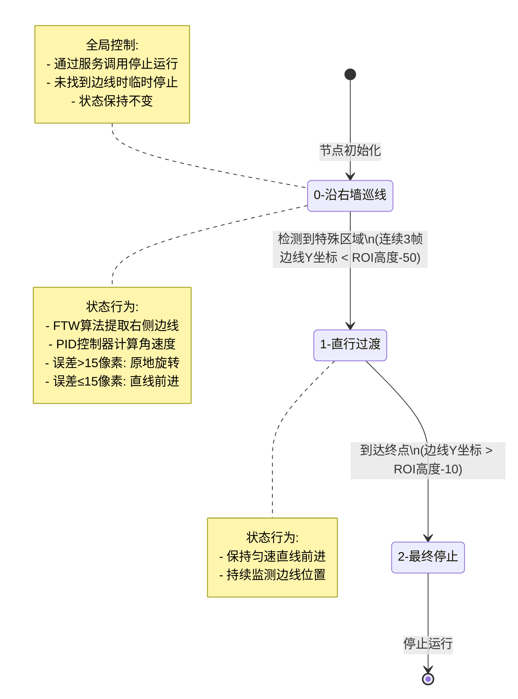

```mermaid
stateDiagram-v2
    %% 状态定义
    STATE_FOLLOW_RIGHT: 0-沿右墙巡线
    STATE_TRANSITION_STRAIGHT: 1-直行过渡
    STATE_FINAL_STOP: 2-最终停止
    
    %% 定义初始状态
    [*] --> STATE_FOLLOW_RIGHT: 节点初始化

    %% 状态转换
    STATE_FOLLOW_RIGHT --> STATE_TRANSITION_STRAIGHT: 检测到特殊区域\n(连续3帧边线Y坐标 < ROI高度-50)
    STATE_TRANSITION_STRAIGHT --> STATE_FINAL_STOP: 到达终点\n(边线Y坐标 > ROI高度-10)
    STATE_FINAL_STOP --> [*]: 停止运行
    
    %% 沿墙巡线状态说明
    note right of STATE_FOLLOW_RIGHT
        状态行为:
        - FTW算法提取右侧边线
        - PID控制器计算角速度
        - 误差>15像素: 原地旋转
        - 误差≤15像素: 直线前进
    end note
    
    %% 直行过渡状态说明
    note right of STATE_TRANSITION_STRAIGHT
        状态行为:
        - 保持匀速直线前进
        - 持续监测边线位置
    end note

    %% 全局控制说明
    note left of STATE_FOLLOW_RIGHT
        全局控制:
        - 通过服务调用停止运行
        - 未找到边线时临时停止
        - 状态保持不变
    end note
```