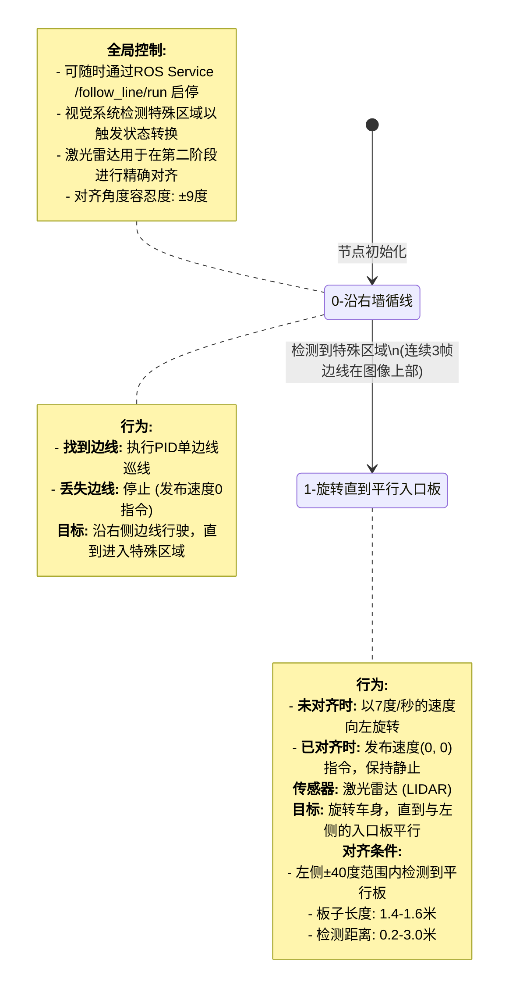

```mermaid
stateDiagram-v2
    %% -- 状态定义 --
    FOLLOW_RIGHT: 0-沿右墙循线
    ALIGN_WITH_ENTRANCE_BOARD: 1-旋转直到平行入口板

    %% -- 初始状态 --
    [*] --> FOLLOW_RIGHT: 节点初始化

    %% -- 状态转换 --
    FOLLOW_RIGHT --> ALIGN_WITH_ENTRANCE_BOARD: 检测到特殊区域\n(连续3帧边线在图像上部)

    %% -- 状态行为说明 --
    note right of FOLLOW_RIGHT
        <b>行为:</b>
        - <b>找到边线:</b> 执行PID单边线巡线
        - <b>丢失边线:</b> 停止 (发布速度0指令)
        <b>目标:</b> 沿右侧边线行驶，直到进入特殊区域
    end note

    note right of ALIGN_WITH_ENTRANCE_BOARD
        <b>行为:</b>
        - <b>未对齐时:</b> 以7度/秒的速度向左旋转
        - <b>已对齐时:</b> 发布速度(0, 0)指令，保持静止
        <b>传感器:</b> 激光雷达 (LIDAR)
        <b>目标:</b> 旋转车身，直到与左侧的入口板平行
        <b>对齐条件:</b>
        - 左侧±40度范围内检测到平行板
        - 板子长度: 1.4-1.6米
        - 检测距离: 0.2-3.0米
    end note

    note left of FOLLOW_RIGHT
        <b>全局控制:</b>
        - 可随时通过ROS Service /follow_line/run 启停
        - 视觉系统检测特殊区域以触发状态转换
        - 激光雷达用于在第二阶段进行精确对齐
        - 对齐角度容忍度: ±9度
    end note
```