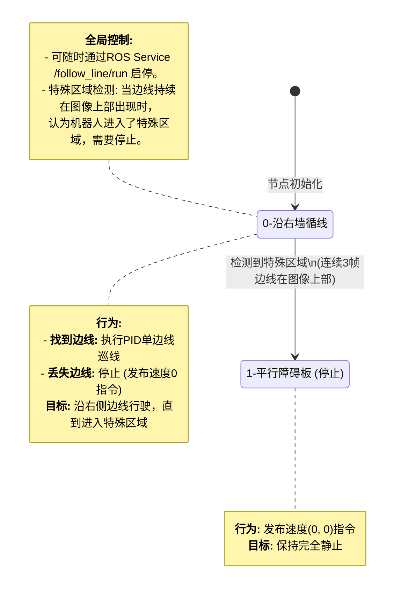

```mermaid
stateDiagram-v2
    %% -- 状态定义 --
    FOLLOW_RIGHT: 0-沿右墙循线
    PARALLEL_OBSTACLE_BOARD: 1-平行障碍板 (停止)

    %% -- 初始状态 --
    [*] --> FOLLOW_RIGHT: 节点初始化

    %% -- 状态转换 --
    FOLLOW_RIGHT --> PARALLEL_OBSTACLE_BOARD: 检测到特殊区域\n(连续3帧边线在图像上部)

    %% -- 状态行为说明 --
    note right of FOLLOW_RIGHT
        <b>行为:</b>
        - <b>找到边线:</b> 执行PID单边线巡线
        - <b>丢失边线:</b> 停止 (发布速度0指令)
        <b>目标:</b> 沿右侧边线行驶，直到进入特殊区域
    end note

    note right of PARALLEL_OBSTACLE_BOARD
        <b>行为:</b> 发布速度(0, 0)指令
        <b>目标:</b> 保持完全静止
    end note

    note left of FOLLOW_RIGHT
        <b>全局控制:</b>
        - 可随时通过ROS Service /follow_line/run 启停。
        - 特殊区域检测: 当边线持续在图像上部出现时，
          认为机器人进入了特殊区域，需要停止。
    end note
```