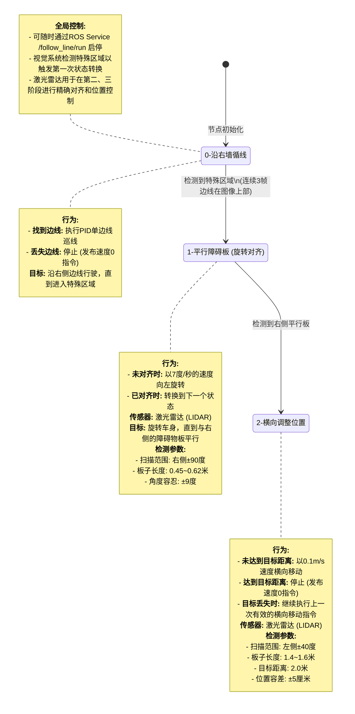

```mermaid
stateDiagram-v2
    %% -- 状态定义 --
    FOLLOW_RIGHT: 0-沿右墙循线
    PARALLEL_OBSTACLE_BOARD: 1-平行障碍板 (旋转对齐)
    ADJUST_LATERAL_POSITION: 2-横向调整位置

    %% -- 初始状态 --
    [*] --> FOLLOW_RIGHT: 节点初始化

    %% -- 状态转换 --
    FOLLOW_RIGHT --> PARALLEL_OBSTACLE_BOARD: 检测到特殊区域\n(连续3帧边线在图像上部)
    PARALLEL_OBSTACLE_BOARD --> ADJUST_LATERAL_POSITION: 检测到右侧平行板

    %% -- 状态行为说明 --
    note right of FOLLOW_RIGHT
        <b>行为:</b>
        - <b>找到边线:</b> 执行PID单边线巡线
        - <b>丢失边线:</b> 停止 (发布速度0指令)
        <b>目标:</b> 沿右侧边线行驶，直到进入特殊区域
    end note

    note right of PARALLEL_OBSTACLE_BOARD
        <b>行为:</b>
        - <b>未对齐时:</b> 以7度/秒的速度向左旋转
        - <b>已对齐时:</b> 转换到下一个状态
        <b>传感器:</b> 激光雷达 (LIDAR)
        <b>目标:</b> 旋转车身，直到与右侧的障碍物板平行
        <b>检测参数:</b>
        - 扫描范围: 右侧±90度
        - 板子长度: 0.45~0.62米
        - 角度容忍: ±9度
    end note

    note right of ADJUST_LATERAL_POSITION
        <b>行为:</b>
        - <b>未达到目标距离:</b> 以0.1m/s速度横向移动
        - <b>达到目标距离:</b> 停止 (发布速度0指令)
        - <b>目标丢失时:</b> 继续执行上一次有效的横向移动指令
        <b>传感器:</b> 激光雷达 (LIDAR)
        <b>检测参数:</b>
        - 扫描范围: 左侧±40度
        - 板子长度: 1.4~1.6米
        - 目标距离: 2.0米
        - 位置容差: ±5厘米
    end note

    note left of FOLLOW_RIGHT
        <b>全局控制:</b>
        - 可随时通过ROS Service /follow_line/run 启停
        - 视觉系统检测特殊区域以触发第一次状态转换
        - 激光雷达用于在第二、三阶段进行精确对齐和位置控制
    end note
```