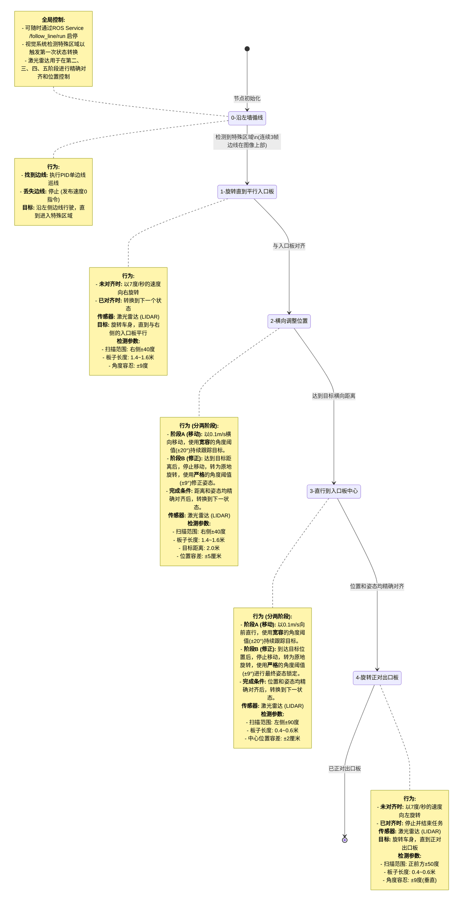

```mermaid
stateDiagram-v2
    %% -- 状态定义 --
    FOLLOW_LEFT: 0-沿左墙循线
    ALIGN_WITH_ENTRANCE_BOARD: 1-旋转直到平行入口板
    ADJUST_LATERAL_POSITION: 2-横向调整位置
    DRIVE_TO_CENTER: 3-直行到入口板中心
    ROTATE_TO_FACE_EXIT_BOARD: 4-旋转正对出口板

    %% -- 初始状态 --
    [*] --> FOLLOW_LEFT: 节点初始化

    %% -- 状态转换 --
    FOLLOW_LEFT --> ALIGN_WITH_ENTRANCE_BOARD: 检测到特殊区域\n(连续3帧边线在图像上部)
    ALIGN_WITH_ENTRANCE_BOARD --> ADJUST_LATERAL_POSITION: 与入口板对齐
    ADJUST_LATERAL_POSITION --> DRIVE_TO_CENTER: 达到目标横向距离
    DRIVE_TO_CENTER --> ROTATE_TO_FACE_EXIT_BOARD: 位置和姿态均精确对齐
    ROTATE_TO_FACE_EXIT_BOARD --> [*]: 已正对出口板

    %% -- 状态行为说明 --
    note right of FOLLOW_LEFT
        <b>行为:</b>
        - <b>找到边线:</b> 执行PID单边线巡线
        - <b>丢失边线:</b> 停止 (发布速度0指令)
        <b>目标:</b> 沿左侧边线行驶，直到进入特殊区域
    end note

    note right of ALIGN_WITH_ENTRANCE_BOARD
        <b>行为:</b>
        - <b>未对齐时:</b> 以7度/秒的速度向右旋转
        - <b>已对齐时:</b> 转换到下一个状态
        <b>传感器:</b> 激光雷达 (LIDAR)
        <b>目标:</b> 旋转车身，直到与右侧的入口板平行
        <b>检测参数:</b>
        - 扫描范围: 右侧±40度
        - 板子长度: 1.4~1.6米
        - 角度容忍: ±9度
    end note

    note right of ADJUST_LATERAL_POSITION
        <b>行为 (分两阶段):</b>
        - <b>阶段A (移动):</b> 以0.1m/s横向移动，使用<b>宽容</b>的角度阈值(±20°)持续跟踪目标。
        - <b>阶段B (修正):</b> 达到目标距离后，停止移动，转为原地旋转，使用<b>严格</b>的角度阈值(±9°)修正姿态。
        - <b>完成条件:</b> 距离和姿态均精确对齐后，转换到下一状态。
        <b>传感器:</b> 激光雷达 (LIDAR)
        <b>检测参数:</b>
        - 扫描范围: 右侧±40度
        - 板子长度: 1.4~1.6米
        - 目标距离: 2.0米
        - 位置容差: ±5厘米
    end note

    note right of DRIVE_TO_CENTER
        <b>行为 (分两阶段):</b>
        - <b>阶段A (移动):</b> 以0.1m/s向前直行，使用<b>宽容</b>的角度阈值(±20°)持续跟踪目标。
        - <b>阶段B (修正):</b> 到达目标位置后，停止移动，转为原地旋转，使用<b>严格</b>的角度阈值(±9°)进行最终姿态锁定。
        - <b>完成条件:</b> 位置和姿态均精确对齐后，转换到下一状态。
        <b>传感器:</b> 激光雷达 (LIDAR)
        <b>检测参数:</b>
        - 扫描范围: 左侧±90度
        - 板子长度: 0.4~0.6米
        - 中心位置容差: ±2厘米
    end note

    note right of ROTATE_TO_FACE_EXIT_BOARD
        <b>行为:</b>
        - <b>未对齐时:</b> 以7度/秒的速度向左旋转
        - <b>已对齐时:</b> 停止并结束任务
        <b>传感器:</b> 激光雷达 (LIDAR)
        <b>目标:</b> 旋转车身，直到正对出口板
        <b>检测参数:</b>
        - 扫描范围: 正前方±50度
        - 板子长度: 0.4~0.6米
        - 角度容忍: ±9度(垂直)
    end note

    note left of FOLLOW_LEFT
        <b>全局控制:</b>
        - 可随时通过ROS Service /follow_line/run 启停
        - 视觉系统检测特殊区域以触发第一次状态转换
        - 激光雷达用于在第二、三、四、五阶段进行精确对齐和位置控制
    end note
```