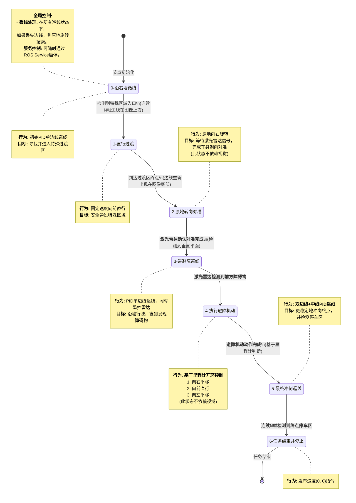

```mermaid
stateDiagram-v2
    %% -- 状态定义 --
    FOLLOW_RIGHT: 0-沿右墙循线
    STRAIGHT_TRANSITION: 1-直行过渡
    ROTATE_ALIGNMENT: 2-原地转向对准
    FOLLOW_RIGHT_WITH_AVOIDANCE: 3-带避障巡线
    AVOIDANCE_MANEUVER: 4-执行避障机动
    FOLLOW_TO_FINISH: 5-最终冲刺巡线
    FINAL_STOP: 6-任务结束并停止

    %% -- 初始状态 --
    [*] --> FOLLOW_RIGHT: 节点初始化

    %% -- 状态转换 --
    FOLLOW_RIGHT --> STRAIGHT_TRANSITION: 检测到特殊区域入口\n(连续N帧边线在图像上方)
    STRAIGHT_TRANSITION --> ROTATE_ALIGNMENT: 到达过渡区终点\n(边线重新出现在图像底部)
    ROTATE_ALIGNMENT --> FOLLOW_RIGHT_WITH_AVOIDANCE: <b>激光雷达确认对准完成</b>\n(检测到垂直平面)
    FOLLOW_RIGHT_WITH_AVOIDANCE --> AVOIDANCE_MANEUVER: <b>激光雷达检测到前方障碍物</b>
    AVOIDANCE_MANEUVER --> FOLLOW_TO_FINISH: <b>避障机动动作完成</b>\n(基于里程计判断)
    FOLLOW_TO_FINISH --> FINAL_STOP: <b>连续N帧检测到终点停车区</b>
    FINAL_STOP --> [*]: 任务结束

    %% -- 状态行为说明 --
    note right of FOLLOW_RIGHT
        <b>行为:</b> 初始PID单边线巡线
        <b>目标:</b> 寻找并进入特殊过渡区
    end note

    note right of STRAIGHT_TRANSITION
        <b>行为:</b> 固定速度向前直行
        <b>目标:</b> 安全通过特殊区域
    end note

    note left of ROTATE_ALIGNMENT
        <b>行为:</b> 原地向右旋转
        <b>目标:</b> 等待激光雷达信号，完成车身朝向对准
        (此状态不依赖视觉)
    end note

    note right of FOLLOW_RIGHT_WITH_AVOIDANCE
        <b>行为:</b> PID单边线巡线，同时监控雷达
        <b>目标:</b> 沿墙行驶，直到发现障碍物
    end note

    note right of AVOIDANCE_MANEUVER
        <b>行为:</b> <b>基于里程计开环控制</b>
        1. 向右平移
        2. 向前直行
        3. 向左平移
        (此状态不依赖视觉)
    end note
    
    note left of FOLLOW_TO_FINISH
        <b>行为:</b> <b>双边线+中线PID巡线</b>
        <b>目标:</b> 更稳定地冲向终点，并检测停车区
    end note
    
    note right of FINAL_STOP
        <b>行为:</b> 发布速度(0, 0)指令
    end note

    note left of FOLLOW_RIGHT
        <b>全局控制:</b>
        - <b>丢线处理:</b> 在所有巡线状态下，
          如果丢失边线，则原地旋转搜索。
        - <b>服务控制:</b> 可随时通过ROS Service启停。
    end note
```