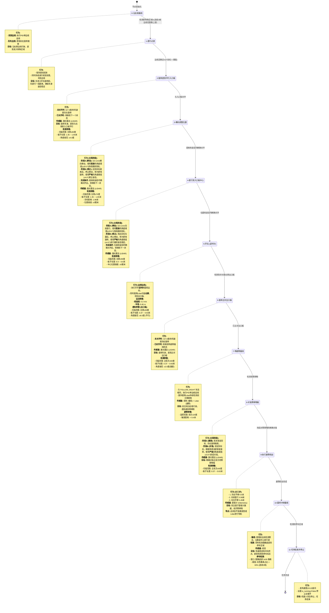

```mermaid
stateDiagram-v2
    %% -- 状态定义 (与代码同步) --
    FOLLOW_RIGHT : 0-沿右墙循线
    STRAIGHT_TRANSITION: 1-直行过渡
    ALIGN_WITH_ENTRANCE_BOARD: 2-旋转直到平行入口板
    ADJUST_LATERAL_POSITION: 3-横向调整位置
    DRIVE_TO_CENTER: 4-直行到入口板中心
    DRIVE_IN_CIRCLE: 5-环岛 (逆时针)
    ROTATE_TO_FACE_EXIT_BOARD: 6-旋转正对出口板
    FOLLOW_RIGHT_WITH_AVOIDANCE: 7-带避障循线
    ALIGN_WITH_OBSTACLE_BOARD: 8-对准障碍物板
    AVOIDANCE_MANEUVER: 9-执行避障机动
    FOLLOW_TO_FINISH: 10-最终冲刺循线
    FINAL_STOP: 11-任务结束并停止

    %% -- 初始状态 --
    [*] --> FOLLOW_RIGHT: 节点初始化

    %% -- 状态转换 (与代码同步) --
    FOLLOW_RIGHT --> STRAIGHT_TRANSITION: 检测到特殊区域\n(连续3帧边线在图像上部)
    STRAIGHT_TRANSITION --> ALIGN_WITH_ENTRANCE_BOARD: 边线足够近\n(Y坐标 > 阈值)
    ALIGN_WITH_ENTRANCE_BOARD --> ADJUST_LATERAL_POSITION: 与入口板对齐
    ADJUST_LATERAL_POSITION --> DRIVE_TO_CENTER: 距离和姿态均精确对齐
    DRIVE_TO_CENTER --> DRIVE_IN_CIRCLE: 位置和姿态均精确对齐
    DRIVE_IN_CIRCLE --> ROTATE_TO_FACE_EXIT_BOARD: 检测到并对准右侧出口板
    ROTATE_TO_FACE_EXIT_BOARD --> FOLLOW_RIGHT_WITH_AVOIDANCE: 已正对出口板
    FOLLOW_RIGHT_WITH_AVOIDANCE --> ALIGN_WITH_OBSTACLE_BOARD: 检测到障碍物
    ALIGN_WITH_OBSTACLE_BOARD --> AVOIDANCE_MANEUVER: 完成对障碍物的精确对准
    AVOIDANCE_MANEUVER --> FOLLOW_TO_FINISH: 避障机动完成
    FOLLOW_TO_FINISH --> FINAL_STOP: 检测到停车区域
    FINAL_STOP --> [*]: 任务完成

    %% -- 状态行为说明 --
    note right of FOLLOW_RIGHT
        <b>行为:</b>
        - <b>找到边线:</b> 执行PID单边线巡线
        - <b>丢失边线:</b> 原地向右旋转搜索
        <b>目标:</b> 沿右侧边线行驶，直到进入特殊区域
    end note

    note right of STRAIGHT_TRANSITION
        <b>行为:</b>
        - 保持直线前进
        - 同时持续进行视觉处理，寻找边线
        <b>目标:</b> 在进入环岛旋转前，先直行一段距离，确保车身姿态稳定
    end note

    note right of ALIGN_WITH_ENTRANCE_BOARD
        <b>行为:</b>
        - <b>未对齐时:</b> 以7.0度/秒的速度向左旋转
        - <b>已对齐时:</b> 转换到下一个状态
        <b>传感器:</b> 激光雷达 (LIDAR)
        <b>目标:</b> 旋转车身，直到与左侧的入口板平行
        <b>检测参数:</b>
        - 扫描范围: 左侧±80度
        - 板子长度: 1.35 ~ 1.65米
        - 角度容忍: ±4.0度
    end note

    note right of ADJUST_LATERAL_POSITION
        <b>行为 (分两阶段):</b>
        - <b>阶段A (移动):</b> 以0.1m/s横向移动，使用<b>宽容</b>的角度阈值(±20.0°)持续跟踪目标。
        - <b>阶段B (修正):</b> 达到目标距离后，停止移动，转为原地旋转，使用<b>严格</b>的角度阈值(±4.0°)修正姿态。
        - <b>完成条件:</b> 距离和姿态均精确对齐后，转换到下一状态。
        <b>传感器:</b> 激光雷达 (LIDAR)
        <b>检测参数:</b>
        - 扫描范围: 左侧±70度
        - 板子长度: 1.35 ~ 1.65米
        - 目标距离: 1.98米
        - 位置容差: ±3厘米
    end note

    note right of DRIVE_TO_CENTER
        <b>行为 (分两阶段):</b>
        - <b>阶段A (移动):</b> 以0.1m/s向前直行，使用<b>宽容</b>的角度阈值(±20.0°)持续跟踪目标。
        - <b>阶段B (修正):</b> 到达目标位置后，停止移动，转为原地旋转，使用<b>严格</b>的角度阈值(±4.0°)进行最终姿态锁定。
        - <b>完成条件:</b> 位置和姿态均精确对齐后，转换到下一状态。
        <b>传感器:</b> 激光雷达 (LIDAR)
        <b>检测参数:</b>
        - 扫描范围: 右侧±90度
        - 板子长度: 0.4 ~ 0.6米
        - 中心位置容差: ±5厘米
    end note

    note right of DRIVE_IN_CIRCLE
        <b>行为 (边转边找):</b>
        - 执行开环<b>逆时针</b>圆周运动。
        - 同时使用Lidar扫描<b>右侧</b>，寻找出口板。
        <b>运动参数:</b>
        - <b>线速度:</b> 0.2 m/s
        - <b>半径:</b> 0.45 m
        <b>感知参数 (出口板):</b>
        - 扫描范围: 右侧±90度
        - 板子长度: 0.37 ~ 0.63米
        - 角度容忍: ±6.0度 (平行)
    end note

    note right of ROTATE_TO_FACE_EXIT_BOARD
        <b>行为:</b>
        - <b>未对齐时:</b> 以7.0度/秒的速度向右旋转
        - <b>已对齐时:</b> 转换到带避障循线状态
        <b>传感器:</b> 激光雷达 (LIDAR)
        <b>目标:</b> 旋转车身，直到正对出口板
        <b>检测参数:</b>
        - 扫描范围: 正前方±50度
        - 板子长度: 0.37 ~ 0.63米
        - 角度容忍: ±2.0度(垂直)
    end note

    note right of FOLLOW_RIGHT_WITH_AVOIDANCE
        <b>行为:</b>
        - 与`FOLLOW_RIGHT`状态相同，执行PID单边线巡线
        - 额外使用Lidar持续检测前方障碍物
        <b>传感器:</b> 视觉 (循线) + Lidar (避障)
        <b>目标:</b> 安全地沿右墙行驶，直到遇到障碍物
        <b>避障参数:</b>
        - 监控范围: 前方±20度
        - 触发距离: < 0.4米
    end note

    note right of ALIGN_WITH_OBSTACLE_BOARD
        <b>行为 (分两阶段):</b>
        - <b>阶段A (搜索):</b> 若未锁定目标，向右旋转搜索。
        - <b>阶段B (对准):</b> 锁定目标后，根据角度误差智能旋转，使用<b>严格</b>的角度阈值(±3.0°)完成对准。
        <b>传感器:</b> 激光雷达 (LIDAR)
        <b>目标:</b> 精确对准正前方的障碍物板
        <b>检测参数:</b>
        - 扫描范围: 正前方±60度
        - 板子长度: 0.37 ~ 0.63米
    end note

    note right of AVOIDANCE_MANEUVER
        <b>行为 (分三步):</b>
        - 1. 向右平移 0.5米
        - 2. 向前直行 0.58米
        - 3. 向左平移 0.45米
        <b>传感器:</b> 里程计 (Odometry)
        <b>目标:</b> 完全基于里程计数据，绕开障碍物
        <b>特点:</b> 此状态不依赖视觉或Lidar进行导航
    end note

    note right of FOLLOW_TO_FINISH
        <b>行为:</b>
        - <b>循线:</b> 使用双边线检测算法，沿赛道中心线行驶
        - <b>检测:</b> 同时检测图像底部的停车区域
        <b>传感器:</b> 视觉
        <b>目标:</b> 快速稳定地冲向终点，直到检测到停车标志
        <b>停车检测:</b>
        - 窗口: 图像底部 3x30 像素
        - 阈值: 白色像素占比 > 60% (连续3帧)
    end note

    note right of FINAL_STOP
        <b>行为:</b>
        - 发布速度(0,0,0)指令
        - 设置 is_running=False 停止主循环
        <b>目标:</b> 机器人完全停止，任务结束
    end note
```